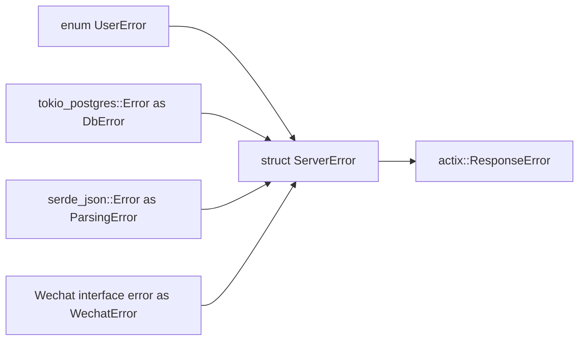

## 错误处理的设计

项目中，为不同的错误分别创建了不同的类型，他们的 “ `From`/`Into`” 关系如下图：



其中 `ServerError` 是这样描述的：

```rust
pub struct ServerError {
    code: u16,
    msg: String,
}
```

`ServerError` 转换成 `ErrorResponse` 的过程中，`ServerError` 序列化为 JSON 字符串存于响应主体里，如：

```json
{code: 1, msg: "Internal services error."}
```

*注：项目中约定服务器尽可能返回 HTTP 200 OK，然后在响应主体里说明错误代码。*

内部错误转换成 `ServerError` 时，`ServerError::code` 为 `1`（内部错误，详见 [错误代码.md](错误代码.md)），`ServerError::msg` 由各子错误设置的属性决定（详见[`failure` 库](https://rust-lang-nursery.github.io/failure)）。

想在 `ServerError` 中添加一个类似于 `inner_message` 的字段，用来保存内部运行时出现的错误信息，并由相应代码计入日志。 

// TODO